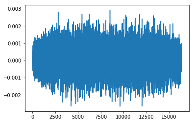

# **x-sampling**: Sample sound transforming with GANs


Send generator G(z) input vector z (100 dimension) as OSC message. 
On Max for Live, use `maxpat` file as max audio effect (open `.amxd`).
then run `run.py`

can be used with videos


---

## Usage

get trained model file.

```shell
# on x-sampling/
sh download_models.sh
```

install dependencies

```shell
pip install -r requirements.txt
```

and start receiving OSC message.

```shell
python run.py
```

---

## Model Training

Use official implementation [/chrisdonahue/wavegan](https://github.com/chrisdonahue/wavegan)

clone on GPGPU server and exec training

```shell
export CUDA_VISIBLE_DEVICES="0"
python train_wavegan.py train ./train --data_dir ./data/
```

### Dataset

get the Dataset **Speech Commands Zero through Nine (SC09)** from Adversarial Audio Synthesis (ICLR 2019)

```shell
sh get_data.sh
```

or other datasets

- [audioset](https://research.google.com/audioset/)
- [FSD: a dataset of everyday sounds](https://annotator.freesound.org/fsd/)

### Requirements

```shell
pip install tensorflow-gpu==1.12.0
pip install scipy==1.0.0
pip install matplotlib==3.0.2
pip install librosa==0.6.2
pip install tensorboard==1.12.1
```

or

```shell
pip install -r requirements.txt
```

---

## Generate Sound

on IPython (Jupyter)

```python
import numpy as np
import tensorflow as tf
from IPython.display import display, Audio

# Load the graph
tf.reset_default_graph()
saver = tf.train.import_meta_graph('model/infer/infer.meta')
graph = tf.get_default_graph()
sess = tf.InteractiveSession()
ckpt = tf.train.get_checkpoint_state('model/')

saver.restore(sess, ckpt.model_checkpoint_path)

# Create 50 random latent vectors z
_z = (np.random.rand(1, 100) * 2.) - 1

# Synthesize G(z)
z = graph.get_tensor_by_name('z:0')
G_z = graph.get_tensor_by_name('G_z:0')
_G_z = sess.run(G_z, {z: _z})

# Play audio in notebook
display(Audio(_G_z[0, :, 0], rate=16000))
```

```python
import matplotlib.pyplot as plt
%matplotlib inline

plt.plot(_G_z[0, :, 0])
```


---

## Python-OSC Sample

```python
# sample processor

def process(*value) -> None:
    send_msg(*value)
    return

from pythonosc import osc_message_builder
from pythonosc import udp_client


client = udp_client.UDPClient("127.0.0.1", 5555)

def send_msg(address: str, msg_value) -> None:
    print(f"address: {address}")
    print(f"msg: {msg_value}")
    msg = osc_message_builder.OscMessageBuilder(address=address)
    msg.add_arg(str(msg_value))
    client.send(msg.build())


from pythonosc import dispatcher
from pythonosc import osc_server

dispatcher = dispatcher.Dispatcher()
dispatcher.map("/sample", process)

server = osc_server.ThreadingOSCUDPServer(("127.0.0.1", 4444), dispatcher)
server.serve_forever()
```

---

## References

- [PyPi: python-osc](https://pypi.org/project/python-osc/)
- [Python data via OSC to Max](https://cycling74.com/forums/python-data-via-osc-to-max)
- [About OSC](https://yoppa.org/ma2_10/2279.html)
- [python-oscを使ってみる](https://techracho.bpsinc.jp/katayama-yuuki/2017_07_13/42884)
- [About Max OSC receiving](https://cycling74.com/forums/receiving-osc)
